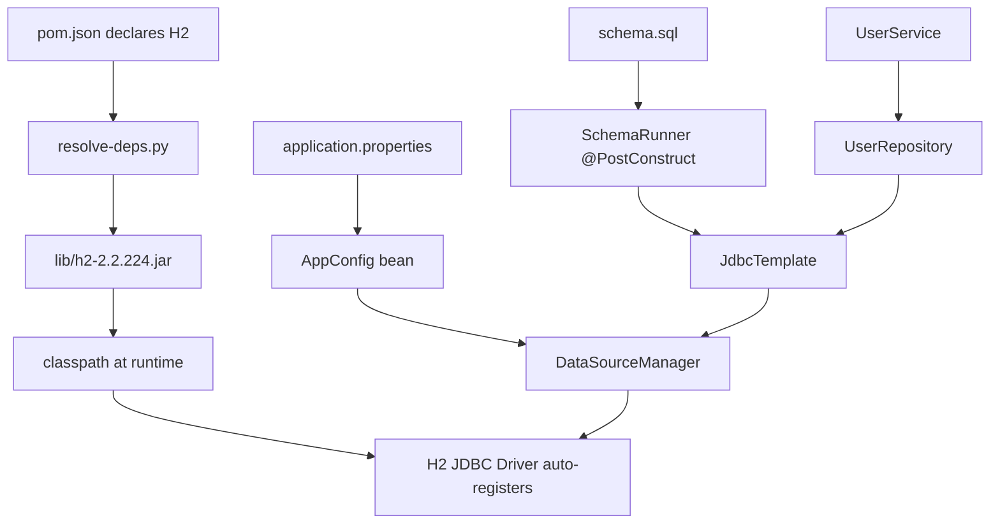

# Database & JDBC Learning Guide

How this project connects to a database — from `pom.json` dependency to SQL rows.

---

## The full data path



---

## Step 1: Declare the driver in pom.json

```json
{
  "groupId": "com.h2database",
  "artifactId": "h2",
  "version": "2.2.224"
}
```

The H2 JAR contains:
- `org.h2.Driver` — implements `java.sql.Driver`
- `META-INF/services/java.sql.Driver` — SPI registration file

When the JAR is on the classpath, Java's `ServiceLoader` registers the driver automatically. That's why we never call `Class.forName("org.h2.Driver")`.

---

## Step 2: Configure the connection

**File:** `src/main/resources/application.properties`

| Property | Example | Meaning |
|----------|---------|---------|
| `db.url` | `jdbc:h2:mem:customspring` | JDBC URL — protocol + vendor + location |
| `db.username` | `sa` | Database user |
| `db.password` | *(empty)* | Database password |

### JDBC URL anatomy

```
jdbc:h2:mem:customspring;DB_CLOSE_DELAY=-1
│    │  │   │              └── connection parameters
│    │  │   └── database name
│    │  └── storage mode (mem = in-memory, file = disk)
│    └── vendor (h2, postgresql, mysql)
└── protocol (always "jdbc" for Java databases)
```

**Spring Boot equivalent:**

```yaml
spring:
  datasource:
    url: jdbc:h2:mem:testdb
    username: sa
    password:
```

---

## Step 3: Define the schema

**File:** `src/main/resources/schema.sql`

```sql
CREATE TABLE IF NOT EXISTS users (
    id    BIGINT PRIMARY KEY,
    name  VARCHAR(100) NOT NULL,
    email VARCHAR(150) NOT NULL UNIQUE
);
```

| Concept | Explanation |
|---------|-------------|
| `PRIMARY KEY` | Unique identifier; no two rows share the same `id` |
| `NOT NULL` | Column must have a value on INSERT |
| `UNIQUE` | No two rows can share the same `email` |
| `IF NOT EXISTS` | Safe to re-run — won't fail if table already exists |

`SchemaRunner` splits this file on `;` and executes each statement via `JdbcTemplate.update()`.

---

## Step 4: JDBC operations in code

### INSERT (write data)

```java
jdbc.update(
    "INSERT INTO users (id, name, email) VALUES (?, ?, ?)",
    user.getId(), user.getName(), user.getEmail()
);
```

- `?` = placeholder (prevents SQL injection)
- Params bind left-to-right: 1st `?` ← `id`, 2nd ← `name`, 3rd ← `email`
- JDBC indexes placeholders from **1**, not 0

### SELECT (read data)

```java
jdbc.query(
    "SELECT id, name, email FROM users ORDER BY id",
    row -> new User(row.getLong("id"), row.getString("name"), row.getString("email"))
);
```

- `RowMapper` converts each `ResultSet` row to a `User` object
- `rs.next()` advances the cursor one row at a time

### SELECT with filter

```java
jdbc.queryOne(
    "SELECT id, name, email FROM users WHERE email = ?",
    row -> new User(...),
    email   // binds to the single ?
);
```

---

## Layered architecture (where SQL lives)

```
UserService          ← NO SQL here — business logic only
    │
    ▼
UserRepository       ← ALL SQL for users table lives here
    │
    ▼
JdbcTemplate         ← Connection management, PreparedStatement
    │
    ▼
DataSourceManager    ← JDBC URL, credentials
    │
    ▼
H2 Database          ← Actual storage
```

**Rule:** Never put SQL in services or controllers. Repositories are the only layer that talks SQL.

---

## H2: why we use it for learning

| Feature | Benefit |
|---------|---------|
| Embedded | No separate database server to install |
| In-memory | Zero config; perfect for demos and tests |
| JDBC compliant | Same API as PostgreSQL, MySQL |
| Fast startup | Ideal for CI and learning |

**Tradeoff:** In-memory data disappears when the app exits. Use file-based or PostgreSQL for persistence.

### File-based H2 (data survives restart)

```properties
db.url=jdbc:h2:file:./data/customspring
```

Creates a `data/` folder on disk with database files.

---

## Switching to PostgreSQL

### 1. Add driver to pom.json

```json
{
  "groupId": "org.postgresql",
  "artifactId": "postgresql",
  "version": "42.7.3",
  "scope": "compile"
}
```

### 2. Start PostgreSQL

```bash
docker run --name pg \
  -e POSTGRES_PASSWORD=secret \
  -e POSTGRES_DB=customspring \
  -p 5432:5432 \
  -d postgres:16
```

### 3. Update application.properties

```properties
db.url=jdbc:postgresql://localhost:5432/customspring
db.username=postgres
db.password=secret
```

### 4. Rebuild and run

```bash
./scripts/build.sh && ./scripts/run.sh
```

**No Java code changes needed** — that's dependency inversion working. Only config and driver JAR change.

---

## JDBC vs JPA vs Spring Data

| Approach | What you write | What the framework does |
|----------|---------------|------------------------|
| **Raw JDBC** (this project) | SQL strings + RowMapper | Connection management only |
| **JdbcTemplate** (Spring) | SQL strings + RowMapper | Connection + exception translation |
| **JPA / Hibernate** | `@Entity` classes + annotations | Generates SQL from object model |
| **Spring Data JPA** | `interface UserRepo extends JpaRepository` | Generates repository implementation |

This project uses raw JDBC + a mini JdbcTemplate so you **see the SQL**. Spring Data hides it for productivity.

---

## Common errors & fixes

| Error | Cause | Fix |
|-------|-------|-----|
| `No suitable driver` | H2 JAR not on classpath | Run `./scripts/build.sh` |
| `application.properties not found` | Resources not copied | Run `./scripts/build.sh` |
| `schema.sql not found` | Same as above | Run `./scripts/build.sh` |
| `Unique index violation` | Duplicate email INSERT | Expected — DB enforces UNIQUE |
| `Connection refused` (PostgreSQL) | DB not running | Start Docker container |
| `Missing required property: db.url` | Typo in properties file | Check key name matches `AppConfig.require()` |

---

## SQL cheat sheet for this project

```sql
-- Create
CREATE TABLE users (id BIGINT PRIMARY KEY, name VARCHAR(100), email VARCHAR(150));

-- Insert
INSERT INTO users (id, name, email) VALUES (1, 'Ada', 'ada@example.com');

-- Select all
SELECT id, name, email FROM users;

-- Select with filter
SELECT id, name, email FROM users WHERE email = 'ada@example.com';

-- Update
UPDATE users SET name = 'Augusta Ada King' WHERE id = 1;

-- Delete
DELETE FROM users WHERE id = 1;
```

---

## What to learn next

1. [EXERCISES.md](./EXERCISES.md) — Level 3 database exercises
2. [build-system.md](./build-system.md) — how pom.json connects JARs to classpath
3. Spring Data JPA tutorial — compare `JpaRepository` to our `UserRepository`
4. Flyway docs — production schema migrations

---

Back to [Learning Guide](./README.md)
