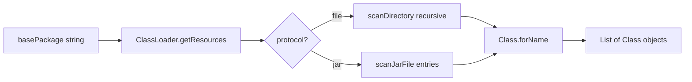
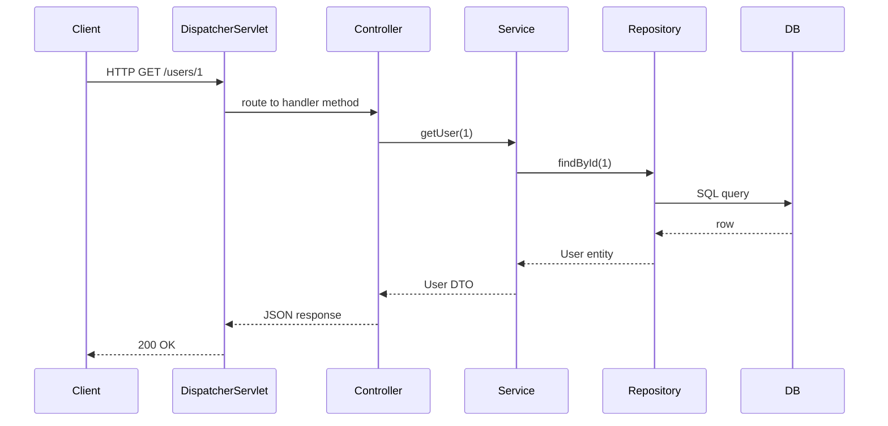

# Your Framework Architecture

> **New to the codebase?** Start with [Code Walkthrough](./CODE-WALKTHROUGH.md) — it guides you file-by-file with learning comments in the source.

This document explains **your** IoC (Inversion of Control) container and how it mirrors the architecture of Spring and other modern Java frameworks.

## What problem does this solve?

Without a container, application code looks like this:

```java
// Manual wiring — tight coupling, hard to test
EmailService email = new SmtpEmailService(new PostgresUserRepository());
OrderService orders = new OrderService(email);
```

Every class decides *how* to build its collaborators. Changing `SmtpEmailService` to `SendGridEmailService` means editing every caller.

**Inversion of Control** flips this: the *framework* creates objects and injects dependencies. Your classes only declare *what* they need.

```java
@Component
public class OrderService {
    @Inject
    private EmailService email;  // container fills this in
}
```

## High-level architecture

```mermaid
flowchart TB
    subgraph bootstrap ["Bootstrap phase (Container.init)"]
        A[scanPackage] --> B[Find @Component / @Service / @Repository]
        B --> C[Instantiate via reflection]
        C --> D[Store in beanRegistry]
        D --> E[injectDependencies]
        E --> F[@PostConstruct lifecycle hooks]
    end

    subgraph runtime ["Runtime phase"]
        G[getBean Class] --> H[Return from beanRegistry]
    end

    bootstrap --> runtime
```

## Component breakdown

### 1. Annotations (`src/main/java/framework/annotations/`)

Annotations are **metadata** attached to code. The JVM preserves them at runtime because of `@Retention(RetentionPolicy.RUNTIME)`.

| Annotation | Target | Purpose | Spring twin |
|------------|--------|---------|-------------|
| `@Component` | class | Mark as managed bean | `@Component` |
| `@Inject` | field | Declare dependency | `@Autowired` |
| `@Repository` | class | Data layer stereotype | `@Repository` |
| `@Service` | class | Business layer stereotype | `@Service` |
| `@PostConstruct` | method | Run after injection | `@PostConstruct` |
| `@PreDestroy` | method | Run on shutdown | `@PreDestroy` |

**`@Component`** — marks a *type* as a bean candidate:

```7:11:src/main/java/framework/annotations/Component.java
@Target(ElementType.TYPE)
@Retention(RetentionPolicy.RUNTIME)
public @interface Component {
    String value() default "";
}
```

**`@Inject`** — marks a *field* as a dependency to resolve:

```7:11:src/main/java/framework/annotations/Inject.java
@Retention(RetentionPolicy.RUNTIME)
@Target(ElementType.FIELD)
public @interface Inject {
}
```

Spring uses the same pattern with richer semantics (`@Service` is a specialized `@Component`, `@Autowired` supports constructors and setters too).

### 2. Container (`src/main/java/framework/core/Container.java`)

The container is the **heart** of the framework. It owns three responsibilities:

| Phase | Method | What happens |
|-------|--------|--------------|
| Discovery | `scanPackage()` | Walk classpath, load `.class` files |
| Registration | `init()` loop | `newInstance()` for each `@Component`, put in map |
| Wiring | `injectDependencies()` | Reflection: find `@Inject` fields, assign matching beans |

#### Bean registry

```11:12:src/framework/core/Container.java
    // The "Registry" holds all the live objects (Beans)
    private final Map<Class<?>, Object> beanRegistry = new HashMap<>();
```

This is a simplified version of Spring's `DefaultSingletonBeanRegistry`. Key design choice: **one bean per class type**. Spring supports multiple beans of the same type via `@Qualifier` and bean names — yours does not yet.

#### Initialization pipeline

```14:31:src/framework/core/Container.java
    public void init(String basePackage) throws Exception {
        System.out.println("⚡ NextGenFW Starting...");

        // Step 1: Scan & Instantiate
        List<Class<?>> classes = scanPackage(basePackage);
        for (Class<?> clazz : classes) {
            // Only create instances for classes marked with @Component
            if (clazz.isAnnotationPresent(Component.class)) {
                Object instance = clazz.getDeclaredConstructor().newInstance();
                beanRegistry.put(clazz, instance);
                System.out.println("Created Bean: " + clazz.getSimpleName());
            }
        }

        // Step 2: Inject Dependencies
        injectDependencies();

        System.out.println("✅ Framework Initialized.");
    }
```

**Order matters:** all beans must exist in the registry *before* injection, because `UserService` might depend on `UserRepository` and vice versa (circular deps — your framework does not handle this yet; Spring uses early references or constructor ordering).

#### Dependency injection

```34:56:src/framework/core/Container.java
    private void injectDependencies() throws IllegalAccessException {
        // Loop through every bean we created
        for (Object bean : beanRegistry.values()) {
            // Look at every field in that bean
            for (Field field : bean.getClass().getDeclaredFields()) {
                if (field.isAnnotationPresent(Inject.class)) {
                    // It's a dependency! Find the matching bean in our registry.
                    Object dependency = beanRegistry.get(field.getType());

                    if (dependency != null) {
                        // Allow modifying private fields
                        field.setAccessible(true);
                        // Inject the dependency
                        field.set(bean, dependency);
                        // ...
                    } else {
                        throw new RuntimeException("Could not find dependency for field: " + field.getName());
                    }
                }
            }
        }
    }
```

This is **field injection via reflection**. Spring's `AutowiredAnnotationBeanPostProcessor` does the same thing (plus constructor and setter injection, optional dependencies, and `@Qualifier`).

`field.setAccessible(true)` bypasses Java access control — frameworks rely on this; in Java 9+ module system, `--add-opens` may be required for deep reflection.

### 3. Classpath scanning

Your `scanPackage()` is production-aware — it handles both **filesystem** (IDE/dev) and **JAR** (packaged app) layouts:



Important Java concepts used here:

- **`Thread.currentThread().getContextClassLoader()`** — lets frameworks load classes in the correct classloader context (critical in app servers and Spring Boot fat JARs).
- **`Class.forName(name, false, classLoader)`** — loads class metadata without initializing static blocks (`false` = don't run static initializers yet).
- **Inner classes skipped** — `$` in class names filtered out in JAR scanning.

Spring's `ClassPathScanningCandidateComponentProvider` uses ASM bytecode reading for speed; yours loads full `Class` objects — simpler, slower, fine for learning.

## Layered architecture (where your container sits)

Modern web apps use **layers**. Your container wires all layers together:

```
┌─────────────────────────────────────────────────────────┐
│  Presentation  │  HTTP, JSON, HTML  │  @Controller     │
├────────────────┼────────────────────┼──────────────────┤
│  Application   │  Business rules    │  @Service        │
├────────────────┼────────────────────┼──────────────────┤
│  Domain        │  Entities, value objects              │
├────────────────┼────────────────────┼──────────────────┤
│  Infrastructure│  DB, email, APIs   │  @Repository     │
└────────────────┴────────────────────┴──────────────────┘
                          ▲
                          │ all beans created & wired by IoC Container
```

Your `@Component` is generic; Spring uses stereotype annotations (`@Service`, `@Repository`, `@Controller`) for clarity and tooling — they all register as beans the same way.

## Design patterns in your framework

| Pattern | Where | Why |
|---------|-------|-----|
| **Inversion of Control** | Whole container | Objects don't construct dependencies |
| **Dependency Injection** | `injectDependencies()` | Dependencies passed in, not looked up |
| **Service Locator** (partial) | `getBean()` | Optional retrieval by type — prefer constructor injection in production |
| **Registry** | `beanRegistry` | Central catalog of live objects |
| **Convention over configuration** | `@Component` scan | Put classes in a package, framework finds them |

## JDBC & database layer

The container wires database access the same way it wires services:

```
application.properties → AppConfig → DataSourceManager → JdbcTemplate → UserRepository → UserService
schema.sql             → SchemaRunner (@PostConstruct)
pom.json (H2 JAR)      → lib/ → classpath → JDBC Driver
```

See [Database Guide](./DATABASE-GUIDE.md) for the full data path and [build-system.md](./build-system.md) for how pom.json connects JARs.

## Lifecycle (your framework vs Spring)

| Stage | Your framework | Spring |
|-------|----------------|--------|
| Scan | `scanPackage` | Component scan / `@Import` / XML |
| Define | implicit (class = bean) | `BeanDefinition` objects |
| Instantiate | `newInstance()` | Factory beans, proxies, scopes |
| Inject | field `@Inject` | `@Autowired`, `@Value`, etc. |
| Init hooks | `@PostConstruct` | `@PostConstruct`, `InitializingBean` |
| Use | `getBean()` | `@Autowired` consumers, HTTP handlers |
| Destroy | `@PreDestroy` | `@PreDestroy`, context shutdown |

## Limitations (intentional — your learning roadmap)

Understanding what's *missing* teaches you what Spring adds:

1. **No constructor injection** — Spring prefers it (immutable, testable). See [Exercise 4.1](./EXERCISES.md).
2. **No `@Qualifier`** — multiple beans of same type can't be disambiguated yet.
3. **No scopes** — Spring has `singleton`, `prototype`, `request`, `session`.
4. **No AOP** — cross-cutting concerns (logging, transactions, security) via proxies.
5. **No circular dependency resolution**.
6. **No conditional beans** — Spring `@ConditionalOnProperty`, profiles.
7. **No event system** — `ApplicationEventPublisher`.
8. **Single classloader assumption** — advanced deployments need more care.

Each limitation is a **feature you can add** to deepen mastery.

## Example: tracing one request (conceptual)

Once you add a web layer, a typical flow is:



Every box except the client and DB is a **bean** wired by the container — exactly what your `Container` does today, extended with HTTP routing on top.

## Key takeaway

> **Spring is not magic.** It is a well-engineered IoC container + classpath scanner + lifecycle manager + ecosystem (web, data, security, cloud).

Your ~170 lines of `Container.java` implement the **core insight**. Everything in Spring 6 is an industrial-strength version of scan → register → inject → serve, with 20 years of edge cases handled.

Next: [Code Walkthrough](./CODE-WALKTHROUGH.md) · [Database Guide](./DATABASE-GUIDE.md) · [Exercises](./EXERCISES.md)
