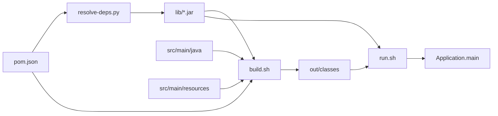

# Build System: pom.json

This project uses **`pom.json`** instead of Maven's **`pom.xml`**. The goal is to make dependency consumption **visible** — you can read one file and follow the scripts that download JARs and wire the classpath.

## The full pipeline



## pom.json structure

```json
{
  "groupId": "com.example",
  "artifactId": "custom-spring",
  "version": "1.0.0",

  "java": {
    "version": "17",
    "sourceDir": "src/main/java",
    "resourcesDir": "src/main/resources",
    "outputDir": "out/classes",
    "mainClass": "com.example.demo.Application"
  },

  "repositories": [
    { "id": "central", "url": "https://repo1.maven.org/maven2" }
  ],

  "dependencies": [
    {
      "groupId": "com.h2database",
      "artifactId": "h2",
      "version": "2.2.224",
      "scope": "compile"
    }
  ]
}
```

### Field reference

| Field | Maven equivalent | Purpose |
|-------|------------------|---------|
| `groupId` | `<groupId>` | Organization / namespace (reverse DNS) |
| `artifactId` | `<artifactId>` | Project name |
| `version` | `<version>` | Release version |
| `java.sourceDir` | `<sourceDirectory>` | Where `.java` files live |
| `java.resourcesDir` | `<resources>` | Config files copied to classpath |
| `java.outputDir` | `<outputDirectory>` | Compiled `.class` output |
| `java.mainClass` | `exec.mainClass` | Entry point for `run.sh` |
| `repositories` | `<repositories>` | Where to download JARs |
| `dependencies` | `<dependencies>` | External libraries |

## How dependencies are resolved

When you run `./scripts/build.sh`, step 1 calls `resolve-deps.py`:

### 1. Read coordinates from pom.json

```
com.h2database : h2 : 2.2.224
```

### 2. Build Maven Central URL

Maven stores artifacts at a predictable path:

```
{repository}/{groupId as path}/{artifactId}/{version}/{artifactId}-{version}.jar
```

For H2:

```
https://repo1.maven.org/maven2/com/h2database/h2/2.2.224/h2-2.2.224.jar
```

This is **exactly** what Maven does internally when you run `mvn dependency:resolve`.

### 3. Download to lib/

```
lib/
└── h2-2.2.224.jar
```

A lock file records what was resolved:

```
lib/.lock.json
```

### 4. Attach to classpath

**Compile time** (`build.sh`):

```bash
javac -cp "lib/*" -d out/classes src/main/java/**/*.java
```

**Runtime** (`run.sh`):

```bash
java -cp "out/classes:lib/*" com.example.demo.Application
```

The H2 driver JAR is now available to:
- `DriverManager.getConnection("jdbc:h2:...")` — JDBC ServiceLoader finds `org.h2.Driver`
- Your code never imports Maven metadata — only classes from the JAR

## How resources connect to the database

```
src/main/resources/application.properties
        │
        │  build.sh copies to out/classes/
        ▼
out/classes/application.properties   ← on classpath root
        │
        │  AppConfig loads via getResourceAsStream("application.properties")
        ▼
DataSourceManager reads db.url, db.username, db.password
        │
        │  DriverManager.getConnection(url, user, pass)
        ▼
H2 in-memory database (from lib/h2-2.2.224.jar)
        │
        │  SchemaRunner runs schema.sql at @PostConstruct
        ▼
users table ready for UserRepository
```

### application.properties

```properties
db.url=jdbc:h2:mem:customspring;DB_CLOSE_DELAY=-1
db.username=sa
db.password=
```

| Property | Role |
|----------|------|
| `db.url` | JDBC URL — tells the driver *what* to connect to |
| `db.username` | Database user |
| `db.password` | Database password |

Spring Boot uses the same pattern with `spring.datasource.url` in `application.yml`.

### schema.sql

Run once at startup by `SchemaRunner` — creates the `users` table before `UserRepository` is used.

## Comparison: pom.json vs pom.xml

**pom.xml** (Maven):

```xml
<dependency>
    <groupId>com.h2database</groupId>
    <artifactId>h2</artifactId>
    <version>2.2.224</version>
</dependency>
```

**pom.json** (this project):

```json
{
  "groupId": "com.h2database",
  "artifactId": "h2",
  "version": "2.2.224"
}
```

Same coordinates. Maven adds:
- Transitive dependency resolution (H2 has none)
- Scope propagation (`compile`, `test`, `provided`)
- Version conflict resolution (nearest wins, etc.)

Our resolver is intentionally simple — one level, explicit versions. That is enough for learning.

## When to graduate to Maven or Gradle

Use real build tools when you need:
- Transitive dependencies (Spring Boot pulls 100+ JARs automatically)
- Test runners (JUnit, Mockito)
- Packaging (fat JAR, WAR)
- CI/CD integration

Until then, `pom.json` + scripts show the **mechanism** without hiding it behind plugin configuration.

## Troubleshooting

| Problem | Fix |
|---------|-----|
| `application.properties not found` | Run `./scripts/build.sh` — resources must be copied to `out/classes` |
| `No suitable driver` | Run `./scripts/build.sh` — H2 JAR missing from `lib/` |
| `HTTP 404` on download | Check `groupId`, `artifactId`, `version` in pom.json |
| Java version error | Install JDK 17+; set `JAVA_HOME` |

---

Back to [Learning Guide](./README.md)
