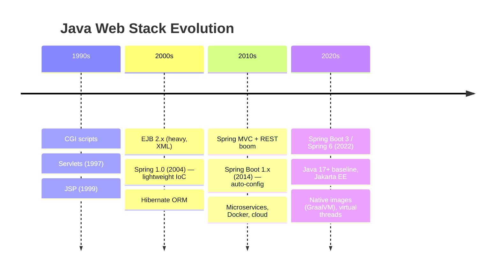

# Evolution of Web Development

Understanding *where* Spring came from explains *why* it looks the way it does. This is the story from basic HTTP handlers to Spring 6.

## Timeline at a glance



## Layer 0: HTTP and the request/response model

Every web framework ultimately does the same thing:

1. Listen on a port (TCP)
2. Parse HTTP (method, path, headers, body)
3. Run application logic
4. Write HTTP response (status, headers, body)

```
Client                    Server
  │  GET /users HTTP/1.1   │
  │ ─────────────────────► │
  │                        │ parse → handler → response
  │  200 OK + JSON body    │
  │ ◄───────────────────── │
```

Everything else — servlets, Spring MVC, reactive streams — is structure around this loop.

## Layer 1: CGI (Common Gateway Interface, ~1990s)

**Idea:** Web server spawns a *new process* per request; the process runs a script (Perl, C, early PHP).

```
Apache → fork() → run script → stdout becomes HTTP body → kill process
```

**Problems:** Process-per-request is slow. No shared state. No object model.

**Lesson learned:** Need a *long-lived* runtime that handles many requests.

## Layer 2: Servlets (Java Servlet API, 1997)

**Idea:** A **JVM stays running** inside the app server (Tomcat, Jetty). Each request is handled by a `Servlet` instance method — no process fork.

```java
public class UserServlet extends HttpServlet {
    protected void doGet(HttpServletRequest req, HttpServletResponse resp) {
        // parse id from req, query DB, write JSON to resp
    }
}
```

**Gains:** Thread-per-request (cheaper than process-per-request). Shared JVM memory.

**Problems:**
- Mapping URLs to servlets = verbose `web.xml`
- Business logic mixed with HTTP parsing
- Manual dependency creation inside servlets

**Your connection:** A servlet *is* a handler. Spring MVC controllers are servlets (or run on top of them) with routing and DI added.

## Layer 3: JSP (JavaServer Pages)

**Idea:** Embed Java in HTML templates — quick UI, messy architecture.

```jsp
<% for (User u : users) { %>
  <li><%= u.getName() %></li>
<% } %>
```

**Problems:** Logic in views. Hard to test. "Tag soup."

**Lesson learned:** Separate **presentation** from **logic** → MVC pattern.

## Layer 4: EJB (Enterprise JavaBeans, late 1990s–2000s)

**Idea:** The *application server* manages components — transactions, remoting, pooling.

```
┌─────────────────────────────────────┐
│  Application Server (WebLogic, etc) │
│  ┌─────────┐ ┌─────────┐           │
│  │ EJB     │ │ EJB     │  JNDI     │
│  │ Session │ │ Entity  │  lookup   │
│  └─────────┘ └─────────┘           │
└─────────────────────────────────────┘
```

**Gains:** Declarative transactions, clustering, enterprise features.

**Problems:**
- Heavyweight — deploy EAR files, vendor lock-in
- Lots of interfaces and XML (`ejb-jar.xml`)
- Slow development cycle
- **Container controls your objects** but in a rigid, opaque way

**Lesson learned:** Developers wanted container benefits *without* EJB ceremony.

## Layer 5: Spring Framework (2004) — the pivot

**Rod Johnson's insight:** Inversion of Control + POJOs (Plain Old Java Objects).

You don't need EJB. You need:
1. A container that wires objects (your `Container.java`)
2. Declarative transactions (AOP, added later)
3. Optional integration (JDBC, ORM, JMS)

```java
// Spring 2.x style — XML wiring (still IoC)
<bean id="userService" class="com.example.UserService">
    <property name="repo" ref="userRepository"/>
</bean>
```

Then **annotations** (Spring 2.5+):

```java
@Service
public class UserService {
    @Autowired
    private UserRepository repo;
}
```

**This is exactly your framework**, with 20 years of production hardening.

### Spring MVC (web layer)

Spring added a **DispatcherServlet** front controller:

```
All URLs → DispatcherServlet → HandlerMapping → Controller → View/JSON
```

Compared to raw servlets: one entry point, annotation routing (`@GetMapping`), content negotiation, exception handlers.

## Layer 6: ORM and the data layer

**JDBC** — verbose, manual SQL mapping:

```java
PreparedStatement ps = conn.prepareStatement("SELECT * FROM users WHERE id = ?");
ps.setLong(1, id);
ResultSet rs = ps.executeQuery();
// map row to User manually...
```

**Hibernate / JPA** — map classes to tables; Spring Data adds repository interfaces:

```java
public interface UserRepository extends JpaRepository<User, Long> {}
// Spring generates implementation at runtime — more IoC + proxies
```

**Pattern:** Each layer abstracts the one below. Your container wires the top layers to the bottom.

## Layer 7: Spring Boot (2014) — opinionated assembly

**Problem:** Even Spring needed lots of XML/config to stand up Tomcat, DataSource, etc.

**Solution:** **Auto-configuration** — classpath detection + sensible defaults:

```
spring-boot-starter-web on classpath
  → embed Tomcat
  → configure DispatcherServlet
  → enable Jackson JSON
  → component scan from @SpringBootApplication
```

```java
@SpringBootApplication  // = @Configuration + @EnableAutoConfiguration + @ComponentScan
public class App {
    public static void main(String[] args) {
        SpringApplication.run(App.class, args);
    }
}
```

Under the hood, Boot still uses an `ApplicationContext` — the same IoC container concept as your `Container.init()`.

Your `scanPackage()` with JAR support mirrors what Boot needs for fat JAR deployment.

## Layer 8: Microservices and cloud (2015+)

**Idea:** Split monolith into independently deployable services.

Spring ecosystem grew:
- **Spring Cloud** — config server, service discovery, circuit breakers
- **Spring Cloud Gateway** — reactive API gateway
- **Kubernetes** — orchestration; Spring adapts with health checks, config maps

**Architecture shift:**

```
Monolith                    Microservices
┌──────────────┐           ┌─────┐ ┌─────┐ ┌─────┐
│ UI+API+DB    │    →      │ API │ │ API │ │ API │
│ one JAR      │           └──┬──┘ └──┬──┘ └──┬──┘
└──────────────┘              └───────┴───────┘
                                    each with own Spring context
```

IoC containers become **per-service**; communication moves to HTTP/gRPC/message queues.

## Layer 9: Spring 6 / Spring Boot 3 (2022) — modern baseline

Major changes:

| Change | Impact |
|--------|--------|
| **Java 17+ required** | Records, sealed classes, pattern matching available |
| **`javax.*` → `jakarta.*`** | Servlet, JPA, annotation packages renamed (Eclipse Jakarta EE) |
| **AOT / Native images** | GraalVM compile-time bean initialization |
| **Observability** | Micrometer, OpenTelemetry integration |
| **HTTP interfaces** | Declarative REST clients without Feign boilerplate |

Spring 6 core IoC is **the same model** as Spring 1 — bean definitions, lifecycle, injection — with a modern foundation.

## Layer 10: Virtual threads (Java 21+) and reactive

**Traditional:** Thread-per-request on platform threads — millions of blocked threads = memory pressure.

**Virtual threads:** Lightweight threads; block on I/O without wasting OS threads. Spring Boot 3.2+ integrates with `@EnableVirtualThreads`.

**Reactive (WebFlux):** Event-loop, non-blocking I/O — different programming model (`Mono`, `Flux`), same DI container wires handlers.

```
Blocking (classic Spring MVC)     Reactive (WebFlux)
Request → Thread → Block on DB    Request → Event loop → callback when DB ready
Simple mental model               Better for high concurrency I/O
```

Most business apps still use blocking MVC; reactive shines at gateway/streaming scale.

## How technologies stack today

```
┌────────────────────────────────────────────────────────────┐
│  Browser / Mobile / API clients                            │
├────────────────────────────────────────────────────────────┤
│  CDN, Load balancer, API Gateway                           │
├────────────────────────────────────────────────────────────┤
│  Spring Boot app                                           │
│  ┌──────────────┐  ┌─────────────┐  ┌──────────────────┐  │
│  │ Spring MVC   │  │ Spring      │  │ Spring Security  │  │
│  │ / WebFlux    │  │ Data JPA    │  │ OAuth2 / JWT     │  │
│  └──────┬───────┘  └──────┬──────┘  └────────┬─────────┘  │
│         └─────────────────┴──────────────────┘            │
│                           │                                │
│              ApplicationContext (IoC)  ← YOUR Container    │
├────────────────────────────────────────────────────────────┤
│  Embedded Tomcat / Netty                                   │
├────────────────────────────────────────────────────────────┤
│  JVM (Java 17/21)                                          │
├────────────────────────────────────────────────────────────┤
│  OS, containers (Docker/K8s)                               │
└────────────────────────────────────────────────────────────┘
```

## Mastering web development — what to focus on

### Foundations (non-negotiable)
- HTTP, REST, status codes, headers
- SQL and basic data modeling
- JVM, classloading, threads
- **IoC and DI** (your project)

### Framework level
- Spring Boot project structure
- Controller → Service → Repository layering
- Configuration (`application.yml`, profiles)
- Testing with `@SpringBootTest`, `@MockBean`

### Production level
- Security (authn/authz, OWASP top 10)
- Observability (logs, metrics, traces)
- Deployment (Docker, health checks, graceful shutdown)
- Database migrations (Flyway/Liquibase)

### Architecture level
- When to split services (and when not to)
- Caching, messaging, idempotency
- CAP tradeoffs, eventual consistency

## The through-line

| Era | Who creates objects? | Who maps URLs? | Who manages transactions? |
|-----|---------------------|----------------|---------------------------|
| CGI | Script itself | Web server config | Script |
| Servlets | Servlet code (`new`) | web.xml | Manual JDBC |
| EJB | Application server | EJB + servlets | Container (declarative) |
| Spring | **IoC container** | Spring MVC | Spring `@Transactional` (AOP) |
| Spring Boot | IoC + auto-config | Same + conventions | Same + starter defaults |

Your custom framework sits in the **Spring row** for object creation. Adding MVC, JPA, and security one piece at a time recreates the historical path — and builds deep understanding.

Next: [Java Internals for Framework Builders](./java-internals.md)
