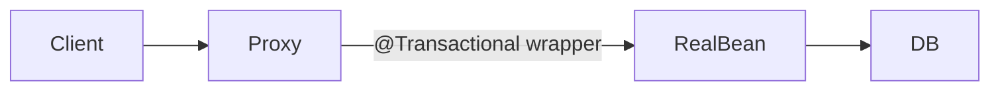

# Java Internals for Framework Builders

Spring, your `Container`, Hibernate, and JUnit all sit on the same JVM primitives. Master these and framework source code becomes readable.

## The JVM execution model (relevant slice)

```
.java source
    │ javac
    ▼
.class bytecode  ──►  ClassLoader loads  ──►  Class<?> metadata in Metaspace
                              │
                              ▼
                    JVM interprets / JIT compiles
                              │
                              ▼
                    Objects on the Heap, frames on the Stack
```

Frameworks mostly operate **after** classes are loaded: they inspect metadata, create instances, and wire references.

## 1. Classloading — how `scanPackage()` finds your beans

### Hierarchy (simplified)

```
Bootstrap ClassLoader  (JDK core: java.lang.*)
        │
Extension ClassLoader  (JDK extensions)
        │
Application ClassLoader  (your classpath — app code lives here)
        │
Context ClassLoader  (per-thread; frameworks set this)
```

Your code uses the **context classloader**:

```77:82:src/framework/core/Container.java
        if (classLoader == null) {
            classLoader = Thread.currentThread().getContextClassLoader();
            // Fallback: Use the classloader that loaded this Container class
            if (classLoader == null) {
                classLoader = Container.class.getClassLoader();
```

**Why?** In a servlet container or Spring Boot nested JAR, the class that *calls* the framework may live in a different loader than the framework itself. Context classloader bridges that gap.

### Loading vs initializing

```java
Class.forName("com.example.UserService", false, classLoader);
//                                      ^^^^^
//                                      false = don't run static {} blocks yet
```

| Step | What happens |
|------|--------------|
| Loading | Read `.class`, create `Class` object |
| Linking | Verify bytecode, prepare fields, resolve references |
| Initialization | Run static initializers (`static {}`) |

Spring often delays initialization until the bean is actually needed (lazy beans) or until the context is fully wired.

### Classpath resources

```java
classLoader.getResources("com/example");  // can return multiple URLs
```

One package path can exist in **multiple JARs**. Spring scans all of them; your container does too.

**Protocols:**
- `file:/path/to/classes/com/example` — exploded directory (IDE, `target/classes`)
- `jar:file:/app.jar!/com/example` — entry inside JAR (production)

## 2. Reflection — how `injectDependencies()` works

Reflection lets code inspect and manipulate classes at runtime.

### Core API used in your container

```java
// Does this class have @Component?
clazz.isAnnotationPresent(Component.class);

// Create instance (requires no-arg constructor)
clazz.getDeclaredConstructor().newInstance();

// Inspect fields
for (Field field : bean.getClass().getDeclaredFields()) {
    field.isAnnotationPresent(Inject.class);
    field.setAccessible(true);  // open private fields
    field.set(bean, dependency); // write the reference
}
```

### What happens under the hood

1. `Field.set()` updates the object's field slot on the heap
2. `setAccessible(true)` suppresses Java language access checks (with module caveats on Java 9+)

### Performance note

Reflection is slower than direct calls. Spring caches `Field`/`Method` metadata after first use. Hibernate uses bytecode generation (CGLIB, Byte Buddy) to avoid reflection on hot paths.

**Insight:** Frameworks pay a startup cost (scanning, reflection) for runtime flexibility.

## 3. Annotations — metadata the container reads

Annotations are interfaces whose instances are synthesized by the JVM.

```java
@Retention(RetentionPolicy.RUNTIME)  // survive to runtime — REQUIRED for DI
@Target(ElementType.TYPE)           // legal on classes only
public @interface Component { }
```

| Retention | Visible when |
|-----------|--------------|
| `SOURCE` | Compiler only (e.g. `@Override`) |
| `CLASS` | Bytecode, not reflection |
| `RUNTIME` | Reflection — **DI frameworks need this** |

Spring and your framework read annotations via reflection. Compile-time processors (e.g. MapStruct, Lombok) use `SOURCE` or `CLASS` retention instead.

### Annotation as configuration

```java
@Component("userService")  // value = bean name in Spring
```

Your `@Component` has `value()` but your container doesn't use it yet — Spring maps it to bean id for `@Qualifier` lookups.

## 4. Object identity and the bean registry

```java
Map<Class<?>, Object> beanRegistry = new HashMap<>();
```

Each `@Component` class maps to **one singleton instance** (default scope in Spring too).

```java
UserService a = container.getBean(UserService.class);
UserService b = container.getBean(UserService.class);
// a == b  → true (same instance)
```

Spring singleton scope: one bean per container. `prototype` scope creates new instances per injection/`getBean()`.

## 5. Proxies — how Spring adds behavior without changing your class

Your container injects **concrete objects**. Spring often injects **proxies** for:

- `@Transactional` — begin/commit/rollback around method calls
- `@Cacheable` — intercept to read/write cache
- Security — check permissions before method runs

### JDK dynamic proxy (interface-based)

```java
UserService proxy = (UserService) Proxy.newProxyInstance(
    loader, new Class[]{UserService.class}, invocationHandler);
```

Only works if bean implements an interface.

### CGLIB / Byte Buddy (class-based)

Subclass your concrete class, override methods, delegate with extra logic.



**You don't see the proxy in source code** — the container returns it from `getBean()`. This is why `@Transactional` fails on `private` methods (proxy can't intercept them).

## 6. Memory and threads (web apps)

### Heap vs stack

| | Stack (per thread) | Heap (shared) |
|--|-------------------|---------------|
| Holds | Method frames, local primitives/refs | All objects, bean instances |
| Lifecycle | Method call | GC when unreachable |
| Your beans | References on stack point to heap objects | Live in heap for app lifetime |

### Thread-per-request

Classic servlet/Spring MVC: one request → one thread → call controller → service → repo.

```java
// Each request thread gets its own stack
// All threads share the same singleton UserService bean on the heap
```

**Thread safety:** Singleton beans must be stateless or synchronize shared mutable state. Request-scoped beans (`@Scope("request")`) are per-request instances — Spring creates/destroys with HTTP request.

### Virtual threads (Java 21+)

Virtual threads are cheap; blocking I/O is OK again at scale. Spring Boot 3.2+ can use them for Tomcat/Jetty. Same IoC model — different thread scheduling.

## 7. Modules (Java 9+) and deep reflection

Java Platform Module System (JPMS) encapsulates packages. Frameworks that `setAccessible(true)` on JDK internals need:

```
--add-opens java.base/java.lang=ALL-UNNAMED
```

Spring Boot abstracts much of this. Your field injection on user classes in unnamed modules usually works without extra flags.

## 8. Generics and type erasure

```java
public <T> T getBean(Class<T> clazz) {
    return clazz.cast(beanRegistry.get(clazz));
}
```

At runtime, `List<String>` and `List<Integer>` are both `List` — type parameters are erased. Spring uses `ResolvableType`, `ParameterizedTypeReference`, and `@Qualifier` to disambiguate generic beans.

Your map keyed by `Class<?>` can't hold two different implementations of the same interface without extra keys — same erasure limitation.

## 9. Exceptions and framework boundaries

Your container throws:

```java
throw new RuntimeException("Could not find dependency for field: " + field.getName());
```

Spring throws `NoSuchBeanDefinitionException`, `UnsatisfiedDependencyException` with full dependency chains — same failure mode, better diagnostics.

**Design lesson:** Fail at **context startup**, not on first request. Your `init()` fails fast — good.

## 10. Mapping Java internals → your code

| JVM concept | Your code | Spring equivalent |
|-------------|-----------|-------------------|
| Context ClassLoader | `scanPackage()` | `ResourceLoader`, LaunchedURLClassLoader (Boot) |
| `Class.forName` | directory + JAR scan | ASM `ClassMetadataReader` (no class load) |
| `Constructor.newInstance` | bean creation | `AutowiredConstructor` resolution |
| `Field.set` | field injection | `AutowiredFieldElement` |
| Singleton on heap | `HashMap` registry | `DefaultSingletonBeanRegistry` |
| Runtime annotations | `@Component`, `@Inject` | Full stereotype + `@Autowired` model |
| Proxies | not yet | `AbstractAutoProxyCreator` |

## Exercises to internalize JVM + DI

1. **Add constructor injection** — use `getDeclaredConstructor(EmailService.class)` instead of field injection.
2. **Log classloader identity** — print `clazz.getClassLoader()` for each scanned class; see hierarchy in action.
3. **Break access** — remove `setAccessible(true)`; observe `IllegalAccessException`.
4. **Two implementations** — two classes implementing `EmailService`; feel the pain that `@Qualifier` solves.
5. **Read `java.lang.reflect.Field` Javadoc** — know what `get`, `set`, `getAnnotations` guarantee.

Next: [Spring 6 Internals](./spring-6-internals.md) — the production container beside yours.
