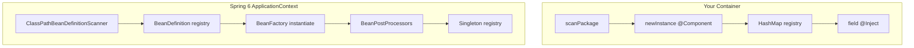
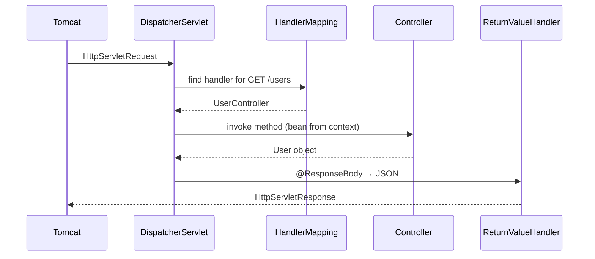

# Spring 6 Internals

Spring 6 (November 2022) is the current major generation, paired with **Spring Boot 3**. This document maps Spring's real internals to your `Container` and highlights what changed in Spring 6.

## Spring 6 at a glance

| Aspect | Detail |
|--------|--------|
| Baseline Java | **17+** (21 recommended for virtual threads) |
| Jakarta EE | `javax.servlet` → `jakarta.servlet`, same for JPA, validation, etc. |
| Boot version | Spring Boot **3.x** aligns with Spring Framework 6 |
| Native / AOT | Ahead-of-time processing for GraalVM native images |
| Removed | Deprecated APIs from Spring 5; some Java EE `javax` support |

**Important:** Core IoC did not change philosophically. Spring 6 modernized the foundation; the bean lifecycle is the same story as your `init()`.

## Architecture: Spring vs your Container



Spring splits **definition** (recipe) from **instance** (object). You combine both in one step.

## The Spring container hierarchy

```
BeanFactory                    ← minimal: getBean, containsBean
    │
DefaultListableBeanFactory     ← bean definitions, autowiring, singletons
    │
ApplicationContext           ← events, i18n, resource loading
    │
AnnotationConfigApplicationContext  ← @Configuration, component scan
    │
Spring Boot: SpringApplication.run() creates context + auto-config
```

Your `Container` ≈ a tiny `DefaultListableBeanFactory` + manual scan, without `BeanDefinition` objects.

## Bean lifecycle (full Spring)

```
1. Instantiate bean
2. Populate properties / constructor args  ← @Autowired, @Value
3. BeanNameAware, BeanFactoryAware, ...    ← callback interfaces
4. BeanPostProcessor.postProcessBeforeInitialization
5. @PostConstruct / InitializingBean.afterPropertiesSet
6. BeanPostProcessor.postProcessAfterInitialization  ← AOP proxies often here
7. Bean ready for use
8. @PreDestroy on context shutdown
```

Your framework: steps 1 and 2 only (instantiate + field inject).

### BeanPostProcessor — Spring's secret weapon

```java
public interface BeanPostProcessor {
    Object postProcessBeforeInitialization(Object bean, String beanName);
    Object postProcessAfterInitialization(Object bean, String beanName);
}
```

Every bean passes through **all** registered post-processors. Examples:

| Processor | Effect |
|-----------|--------|
| `AutowiredAnnotationBeanPostProcessor` | `@Autowired`, `@Value`, `@Inject` |
| `CommonAnnotationBeanPostProcessor` | `@PostConstruct`, `@PreDestroy` |
| `ApplicationContextAwareProcessor` | injects `ApplicationContext` |
| AOP auto-proxy creators | wrap bean in proxy |

**Your equivalent:** a single hard-coded `injectDependencies()` method. To extend your framework Spring-style, register a list of `BeanPostProcessor` implementations instead of one inject method.

## Component scanning — Spring's version of `scanPackage()`

Spring's `ClassPathBeanDefinitionScanner`:

1. Uses **ASM** to read class files without loading every class (faster, avoids side effects from static blocks)
2. Checks for `@Component` (and meta-annotations: `@Service`, `@Repository`, `@Controller`)
3. Registers a `ScannedGenericBeanDefinition` — not the instance yet
4. Later, `refresh()` instantiates all definitions

Your scanner loads full `Class` objects — simpler, equivalent for small apps.

### `@SpringBootApplication` composition

```java
@SpringBootApplication
// = @Configuration
// + @EnableAutoConfiguration
// + @ComponentScan(basePackages = "com.example")
public class Application { }
```

`@ComponentScan` is your `init("com.example")` with filtering, lazy loading, and index support (`spring-context-indexer` for faster startup).

## Dependency injection in Spring 6

### Injection styles (preference order in modern Spring)

1. **Constructor injection** (recommended) — immutable, explicit, test-friendly
2. **Setter injection** — optional dependencies
3. **Field injection** — concise but hard to test (your current style)

```java
@Service
public class OrderService {
    private final OrderRepository repo;

    public OrderService(OrderRepository repo) {  // Spring 4.3+: @Autowired optional on single ctor
        this.repo = repo;
    }
}
```

### Disambiguation

| Problem | Spring solution |
|---------|-----------------|
| Two `UserRepository` beans | `@Qualifier("jdbc")` or `@Primary` |
| Interface with one impl | Auto-wire by type |
| Optional dependency | `@Autowired(required = false)` or `Optional<T>` |
| Constructor cycle | Spring breaks with early singleton exposure (prefer redesign) |

### JSR-330 (`@Inject`)

Spring supports `jakarta.inject.Inject` alongside `@Autowired`. Your `@Inject` mirrors the JSR-330 field style.

## Configuration beyond annotations

### `@Configuration` and `@Bean`

```java
@Configuration
public class AppConfig {
    @Bean
    public DataSource dataSource() {
        return new HikariDataSource();  // third-party class — can't add @Component
    }
}
```

Method return values become beans. Spring CGLIB-subclasses `@Configuration` to honor `@Bean` singleton semantics (multiple calls return same instance).

Your framework only supports `@Component` on classes — adding `@Bean` methods is a natural next step.

### `application.yml` and `@ConfigurationProperties`

External config binds to typed objects:

```yaml
app:
  mail:
    host: smtp.example.com
```

```java
@ConfigurationProperties(prefix = "app.mail")
public record MailProperties(String host) {}
```

Spring Boot's `Environment` abstracts properties; your container has no `Environment` yet.

## Web layer — Spring MVC internals

When you add `spring-boot-starter-web`:



Key types:
- **`DispatcherServlet`** — front controller (one servlet handles all `@RequestMapping`)
- **`HandlerMapping`** — URL → controller method
- **`HandlerAdapter`** — invokes method with resolved `@PathVariable`, `@RequestBody`
- **`HttpMessageConverter`** — Jackson converts JSON ↔ Java objects

**Connection to IoC:** Controllers are beans. `DispatcherServlet` gets them from `ApplicationContext` — same registry concept as your `getBean()`.

## Data layer — Spring Data JPA

```java
public interface UserRepository extends JpaRepository<User, Long> {
    List<User> findByEmail(String email);  // derived query — no SQL written
}
```

Spring Data creates a **runtime proxy** implementing the interface, backed by `EntityManager`. Another use of JDK proxies + IoC.

Transaction boundary:

```java
@Transactional  // AOP proxy wraps service method
public void transfer(Long from, Long to, BigDecimal amount) { ... }
```

## Spring 6 specific: AOT and native images

Traditional Spring: scan and reflect at **startup** (your model).

**Spring Boot 3 native / AOT:** process beans at **build time**:

```
mvn -Pnative native:compile
  → Spring AOT engine generates bean factory code
  → GraalVM compiles to standalone binary
  → Fast startup, lower memory — no classpath scanning at runtime
```

Tradeoff: less runtime flexibility (dynamic features restricted), much faster cold start — ideal for serverless/Kubernetes scale-to-zero.

Your educational container is **runtime reflection** — the classic model Spring used for decades.

## Spring 6 specific: observability

Spring Boot 3 integrates **Micrometer** + **OpenTelemetry**:

- Auto-configures metrics (HTTP, JVM, DataSource pool)
- Trace propagation across services
- Actuator endpoints (`/actuator/health`, `/metrics`)

Production mastery requires understanding what's exposed and how alerts attach to it.

## Spring 6 specific: HTTP interfaces

```java
@HttpExchange(url = "/api")
public interface UserClient {
    @GetExchange("/users/{id}")
    User getUser(@PathVariable long id);
}
```

Declarative REST client — Spring generates implementation (similar spirit to Spring Data repositories).

## Security (brief)

`spring-security` is a filter chain **before** `DispatcherServlet`:

```
Request → SecurityFilterChain (auth, CSRF, etc.) → DispatcherServlet → Controller
```

Security filters are beans too — wired by the same context.

## Side-by-side reference

| Concern | Your Container | Spring 6 |
|---------|----------------|----------|
| Mark bean | `@Component` | `@Component` + stereotypes |
| Inject | `@Inject` field | Constructor `@Autowired`, etc. |
| Scan | `scanPackage` + reflection | ASM scan + filters |
| Registry | `Map<Class, Object>` | `DefaultSingletonBeanRegistry` |
| Third-party beans | not supported | `@Bean`, `@Import` |
| Scopes | singleton only | singleton, prototype, request, session, ... |
| Lazy init | no | `@Lazy`, lazy-init XML |
| Events | no | `ApplicationEventPublisher` |
| AOP | no | `@Aspect`, `@Transactional` |
| Web | no | Spring MVC / WebFlux |
| Config files | no | `Environment`, YAML, profiles |
| Testing | manual | `@SpringBootTest`, `@MockBean`, Testcontainers |

## Recommended Spring source reading order

1. **`org.springframework.context.annotation.ClassPathScanningCandidateComponentProvider`** — compare to your `scanPackage`
2. **`org.springframework.beans.factory.support.DefaultListableBeanFactory`** — bean registry
3. **`org.springframework.beans.factory.annotation.AutowiredAnnotationBeanPostProcessor`** — compare to `injectDependencies`
4. **`org.springframework.web.servlet.DispatcherServlet`** — request dispatch
5. **`org.springframework.boot.SpringApplication`** — Boot bootstrap

Use GitHub tag `v6.1.x` or browse in your IDE after downloading sources.

## Spring Boot 3 starter map

| Starter | Brings in |
|---------|-----------|
| `spring-boot-starter-web` | Tomcat, Spring MVC, Jackson |
| `spring-boot-starter-data-jpa` | Hibernate, JDBC, transactions |
| `spring-boot-starter-security` | Authentication, authorization filters |
| `spring-boot-starter-test` | JUnit 5, MockMvc, AssertJ |
| `spring-boot-starter-validation` | Jakarta Bean Validation |

Each starter is **dependency + auto-configuration classes** that run when JAR is on classpath — conditional beans (`@ConditionalOnClass`, etc.).

## Master checklist

Use this to gauge depth:

- [ ] Explain IoC without saying "Spring magic"
- [ ] Trace `Container.init()` and name the Spring equivalent for each line
- [ ] Describe why constructor injection beats field injection
- [ ] Explain what a JDK proxy does for `@Transactional`
- [ ] Walk HTTP request through `DispatcherServlet` to database and back
- [ ] Explain `javax` vs `jakarta` rename
- [ ] Know when native/AOT helps vs hurts
- [ ] Configure a Boot app with profiles (`dev`, `prod`)
- [ ] Write an integration test with `@SpringBootTest` and `@MockBean`

## Closing insight

Spring 6 is a **mature IoC container** plus **ecosystem modules** built on Java 17 and Jakarta EE.

Your project contains the seed:

```
scan → register → inject → serve
```

Every advanced topic (AOP, events, reactive, cloud, native) attaches to that seed. Build features on your `Container` one at a time, and Spring documentation will read like an upgrade guide rather than a mystery.

---

Back to [Learning Guide index](./README.md)
